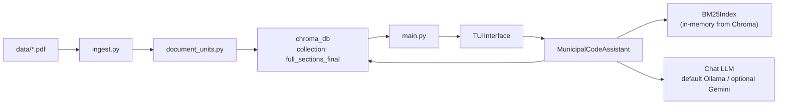
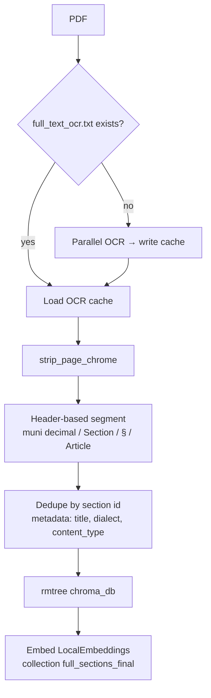
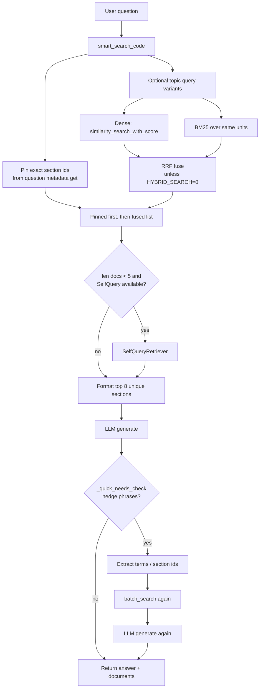

# System Architecture

How El Paso Municipal Code AI is wired today.

Related docs: [CHEATSHEET.md](CHEATSHEET.md) (upgrade narrative) · [IMPROVEMENT_PLAN.md](IMPROVEMENT_PLAN.md) (backlog) · [ARCHITECTURE_AWS.md](ARCHITECTURE_AWS.md) (same product on AWS)

## Big picture

Two phases: **ingest once**, then **query repeatedly**.

| Phase | Entry | Output |
| --- | --- | --- |
| Ingest | `python ingest.py` | Wiped+rebuilt `chroma_db/`; may create/reuse `full_text_ocr.txt` |
| Runtime | `python main.py` | TUI Q&A: hybrid retrieve sections → LLM answer (default Ollama) |



## Runtime components

```text
main.py
  └── TUIInterface                         # terminal UX
        └── MunicipalCodeAssistant
              ├── LocalEmbeddings          # Chroma ONNX MiniLM
              ├── Chroma (chroma_db/)      # dense vectors + metadata
              ├── BM25Index                # hybrid_retriever.py; rebuilt on initialize()
              ├── SelfQueryRetriever       # optional fallback if <5 docs (langchain_classic)
              └── Chat LLM (_create_llm)
                    default: Ollama (llama3)
                    optional: Gemini (LLM_PROVIDER=google)
```

| Module | Role |
| --- | --- |
| `ingest.py` | OCR/cache → unitize → wipe Chroma → embed |
| `document_units.py` | Chrome strip, header split, dedupe, `content_type` |
| `local_embeddings.py` | LangChain wrapper around Chroma MiniLM |
| `hybrid_retriever.py` | BM25 index + RRF fusion |
| `municipal_code_assistant.py` | Search + answer loop |
| `tui_interface.py` | Display only |
| `golden_questions.py`, `verify_step1.py`, `verify_step2.py` | Evaluation helpers |

**Not on the primary path** (legacy / diagnostics):

| File | Notes |
| --- | --- |
| `load_ocr_to_db.py` | Alternate DB `chroma_db_final_structured` + Google embeddings |
| `debug_ask.py`, `check_databases.py`, `quick_pdf_test.py` | Diagnostics |
| `diagnostic_imports.py`, `find_retriever.py` | LangChain import helpers |

## Ingestion pipeline



**Per stored document**

| Field | Meaning |
| --- | --- |
| `page_content` | `"section - title"` + body (full section unit, not child chunks) |
| `metadata.section` | Stable id (e.g. `12.44.020`) — used by search, SelfQuery, TUI |
| `metadata.title` | Header title text |
| `metadata.heading_dialect` | e.g. `municipal_decimal` |
| `metadata.content_type` | `prose` or `table` |

Ingest **replaces** `chroma_db/` (`shutil.rmtree`); it does not append.

## Query pipeline

Entry: `MunicipalCodeAssistant.ask_question`.



### Retrieval

Hybrid search is **on by default** (dense + BM25 fused with RRF). Set `HYBRID_SEARCH=0` for dense search plus section-id pinning only.

1. **Section-id pin** — extract ids from the question → Chroma `get(where={"section": ...})` → `match_type=section_id`.
2. **Dense** — `similarity_search_with_score`; store `metadata.distance` (lower = closer).
3. **BM25** — `BM25Index` built from all Chroma units on `initialize()`; same corpus as the vectors.
4. **RRF** — `rrf_fuse(dense_ranking, bm25_ranking)`; `match_type` is `dense`, `bm25`, or `hybrid`.
5. **Topic expansions** — small hard-coded extra queries for a few topics (fence, animals, public-conduct slang, etc.).
6. **SelfQuery** — runs only when smart search returns fewer than 5 documents.

Ranking does **not** use city- or chapter-prefix score bonuses.

### Generation

- **LLM:** Ollama `llama3` by default; Gemini when `LLM_PROVIDER=google` and `GOOGLE_API_KEY` is set.
- **Prompt:** `_create_summary_chain` defines persona, goal, constraints, and output format — plain-language first sentence, cite the controlling section, short quote if needed, no invented penalties.
- **LLM context:** top **8** unique sections via `_format_retrieved_docs` (each truncated ~1000 chars).
- **TUI:** prints every document in `result["documents"]` (the full candidate pool), which can be larger than the 8 sections sent to the model.
- **Optional second pass:** if the answer matches hedge phrases (`_quick_needs_check`), run one more search and regenerate.

## Config & dependencies

```text
Local
  data/*.pdf                 source PDF
  full_text_ocr.txt          OCR cache (gitignored)
  chroma_db/                 dense index (gitignored)
  MiniLM ONNX                via chromadb DefaultEmbeddingFunction
  BM25                       rank_bm25, in-memory at runtime
  Ollama                     default chat LLM

Env
  LLM_PROVIDER               ollama (default) | google | gemini
  OLLAMA_MODEL / OLLAMA_BASE_URL
  GOOGLE_API_KEY / GOOGLE_MODEL   only for Google path
  HYBRID_SEARCH              default on; 0/false disables BM25+RRF
```

Embeddings on the primary path do not require Google.

## Out of scope today

These are not part of the running system (see the improvement plan if pursuing them):

- Child-chunk embed / parent-section return
- Cross-encoder re-ranking
- SelfQuery gated on answer sufficiency instead of document count
- TUI limited to sections that entered the LLM context
- Codes-only mode with no LLM

## Extension points

1. **Unitization** — `document_units.py` (headers, chrome, metadata)
2. **Ingest / wipe policy** — `ingest.py`
3. **Embeddings** — `local_embeddings.py` (must match ingest ↔ query)
4. **Retrieval** — `smart_search_code`, `batch_search`, `hybrid_retriever.py`
5. **Answer prompt / loop** — `_create_summary_chain`, `ask_question`
6. **UI** — `tui_interface.py`
