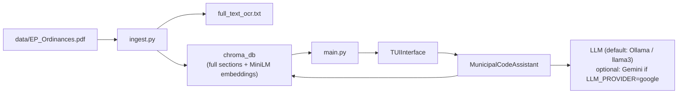
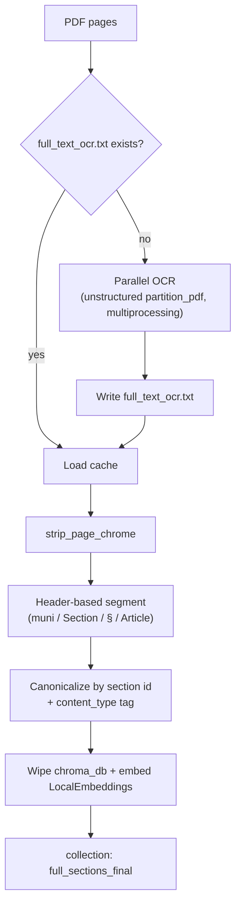
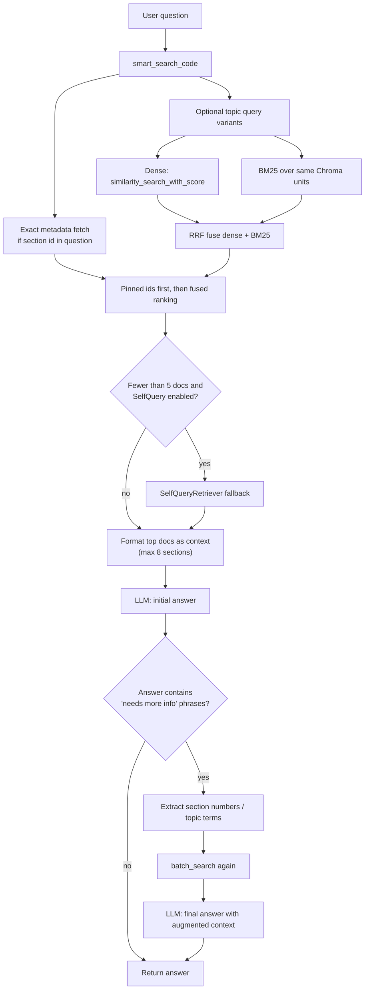

# System Architecture

High-level map of how El Paso Municipal Code AI is wired today. This describes the **current code paths**, not aspirational README claims.

Planned enhancements live in [IMPROVEMENT_PLAN.md](IMPROVEMENT_PLAN.md) — add items there as we review this doc, then update this map when behavior changes.

## Big picture

Two phases: **ingest once**, then **query repeatedly**.

| Phase | Entry | Output |
| --- | --- | --- |
| Ingest | `python ingest.py` | `chroma_db/` (persistent Chroma collection) + optional `full_text_ocr.txt` cache |
| Runtime | `python main.py` | Terminal Q&A via LLM (default: local Ollama), grounded on retrieved code sections |



## Runtime components

```text
main.py
  ├── MunicipalCodeAssistant   # retrieval + LLM orchestration
  │     ├── LocalEmbeddings    # Chroma default ONNX MiniLM
  │     ├── Chroma             # vector store at chroma_db/
  │     ├── SelfQueryRetriever # optional fallback (langchain_classic)
  │     └── Chat LLM via `_create_llm()`
  │           default: Ollama (`llama3`)
  │           optional: Gemini (`LLM_PROVIDER=google`)
  └── TUIInterface             # terminal UX only
```

Supporting / secondary scripts (not on the primary path):

| File | Role |
| --- | --- |
| `load_ocr_to_db.py` | Alternate ingest into `chroma_db_final_structured` (Google embeddings; older path) |
| `debug_ask.py`, `check_databases.py`, `quick_pdf_test.py` | Diagnostics / experiments |
| `diagnostic_imports.py`, `find_retriever.py` | LangChain import hunting helpers |

## Ingestion pipeline

Primary path: `ingest.py` + `document_units.py` (step 1).



What is stored per document:

- `page_content`: heading line + section body (not child chunks)
- `metadata.section`: stable unit id (e.g. `20.16.030`)
- `metadata.title`, `metadata.heading_dialect`, `metadata.content_type` (`prose` | `table`)

**Note:** Ingest **replaces** `chroma_db/` (`rmtree`), it does not append. There is still no `ParentDocumentRetriever` (that is plan step 4).

## Query pipeline

Primary path: `MunicipalCodeAssistant.ask_question`.



### Retrieval details (important)

**Hybrid is on by default** (step 3): dense Chroma + BM25 over the same units, fused with RRF. Set `HYBRID_SEARCH=0` for dense-only (step 2 path).

1. **Section-id pin:** question contains `12.44.020` → metadata fetch first (`match_type=section_id`).
2. **Dense:** `similarity_search_with_score` (distances kept).
3. **Sparse:** in-memory BM25 (`rank_bm25`) rebuilt from Chroma on `initialize()` — same units as embeddings.
4. **Fusion:** Reciprocal Rank Fusion over dense + BM25 rankings (`hybrid_retriever.rrf_fuse`).
5. **Topic expansions:** still present lightly; hybrid reduces reliance on them for exact phrasing.
6. **Self-query:** optional few-result fallback (policy change still planned in step 5).

No cross-encoder yet. Child/parent chunking is still plan step 4.

### Generation

- Default model: local **Ollama** (`llama3` via `langchain_ollama`), `http://127.0.0.1:11434`
- Optional: **Gemini** (`gemini-2.5-flash`) when `LLM_PROVIDER=google` and `GOOGLE_API_KEY` is set
- Prompt: fixed template asking for a direct YES/NO, section citation, and practical guidance
- Self-correction: string sniffing on the model output (`_quick_needs_check`); if triggered, one extra retrieval round then a second generation

## Data & external dependencies

```text
Local
  data/EP_Ordinances.pdf     source ordinances
  full_text_ocr.txt          OCR cache (gitignored)
  chroma_db/                 vector index (gitignored)
  local MiniLM (ONNX)        embeddings via chromadb DefaultEmbeddingFunction
  Ollama                     default chat LLM (answer generation + SelfQuery)

Remote (optional)
  Google Generative AI       only if LLM_PROVIDER=google
  GOOGLE_API_KEY             required only for that provider
```

Embeddings for the primary DB do **not** require Google. The default LLM path is fully local (Ollama).

## What the README overstates vs reality

| Claim | Current code |
| --- | --- |
| ParentDocumentRetriever (child chunks → parent sections) | Not used yet (plan step 4); full header units are indexed |
| Hybrid vector + keyword search | **Yes (step 3):** Chroma dense + BM25, RRF fuse (`HYBRID_SEARCH=0` to disable) |
| BM25 / sparse retrieval | **Yes** — in-memory BM25 rebuilt from Chroma on initialize |
| Agentic multi-step search | Light loop: search → generate → phrase check → optional second search |
| Split on every section-id mention | **Fixed (step 1):** header-based unitization via `document_units.py` |

## Extension points

If you change architecture, these are the natural seams:

1. **Ingest chunking** — `ingest.py` section split / filter logic
2. **Embeddings** — `local_embeddings.py` (must stay consistent between ingest and query)
3. **Retrieval policy** — `smart_search_code` / `batch_search` / `relevance_score`
4. **Answer loop** — `ask_question` and the `_quick_*` helpers
5. **UI** — `tui_interface.py` (swap for API/web without touching retrieval)
