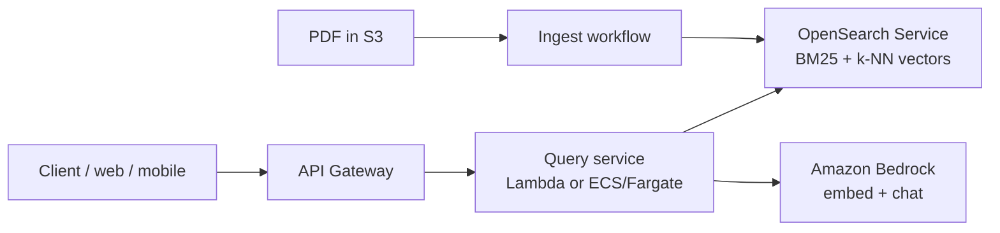
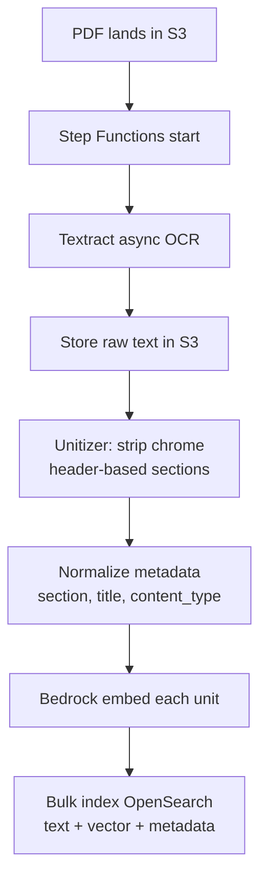
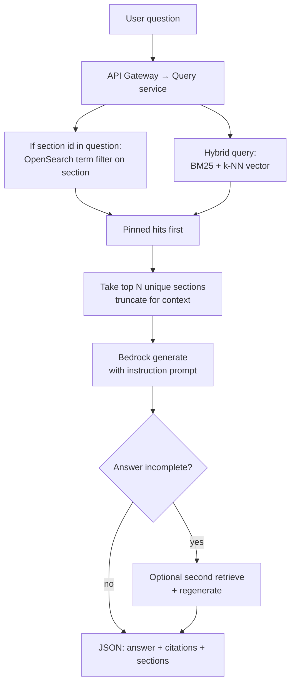

# AWS Architecture

How the same municipal-code Q&A product looks when built on AWS managed services instead of the local custom stack (Chroma, in-process BM25, Ollama, terminal UI).

Capability goal matches [ARCHITECTURE.md](ARCHITECTURE.md): ingest ordinance PDFs into section units, hybrid retrieve (keyword + vector), answer in plain language with citations.

## Big picture

Two phases: **ingest**, then **query**.

| Phase | Local today | On AWS |
| --- | --- | --- |
| Ingest | `ingest.py` + OCR cache + wipe Chroma | S3 + Textract + Step Functions/Lambda (or ECS) → OpenSearch index |
| Runtime | `main.py` TUI + Ollama | API Gateway + compute → OpenSearch hybrid query → Bedrock generation |



## Component map (local → AWS)

| Concern | Local system | AWS equivalent |
| --- | --- | --- |
| Raw PDF storage | `data/*.pdf` | **S3** object store |
| OCR / text extraction | Unstructured / OCR → `full_text_ocr.txt` | **Amazon Textract** (async for large PDFs); text landing in S3 |
| Section unitization | `document_units.py` | Same logic in **Lambda** or **Fargate** task (containerized Python) |
| Dense vectors | Chroma + local MiniLM | **Bedrock** embeddings (e.g. Titan Embed / Cohere Embed) written into OpenSearch k-NN fields |
| Keyword / BM25 | In-memory `rank_bm25` | **OpenSearch** full-text (BM25) on the same documents |
| Hybrid fusion | Custom RRF | OpenSearch **hybrid search** (BM25 + vector) or application-side RRF over two queries |
| Section-id exact fetch | Chroma metadata `get` | OpenSearch **term filter** on `section.keyword` |
| Chat LLM | Ollama / optional Gemini | **Amazon Bedrock** converse (Claude, Llama, etc.) |
| Optional structured retrieve | LangChain SelfQuery | OpenSearch filters + optional Bedrock tool-use to build the filter |
| API / UI | Terminal TUI | **API Gateway** + **Lambda**/Fargate; UI on **Amplify** or static S3+CloudFront |
| Secrets / config | `.env` | **Secrets Manager** / **SSM Parameter Store** |
| Orchestration (ingest) | Local script | **Step Functions** (OCR → unitize → embed → index) |
| Observability | Prints / local files | **CloudWatch** logs/metrics; optional **X-Ray** |

## Runtime shape

```text
Client
  └── Amazon API Gateway
        └── Query service (Lambda or ECS/Fargate)
              ├── Bedrock Runtime          # embed query + generate answer
              ├── OpenSearch               # hybrid retrieve + section filters
              └── Prompt / answer policy   # same persona/goal/constraints/format
```

Ingest is a separate workflow, not the request path:

```text
S3 (PDF upload or batch)
  └── Step Functions
        ├── Textract (OCR)
        ├── Unitizer task (header split, chrome strip, dedupe)
        ├── Bedrock embeddings (batch)
        └── OpenSearch bulk index (replace or versioned index)
```

## Ingestion pipeline



**Per indexed document** (same logical model as local):

| Field | Meaning |
| --- | --- |
| `text` / `page_content` | Section heading + body |
| `section` | Stable id (e.g. `12.44.020`) — keyword field for exact match |
| `title` | Header title |
| `heading_dialect` | e.g. municipal decimal |
| `content_type` | `prose` or `table` |
| `embedding` | Dense vector from Bedrock |

Re-ingest uses a **new index** (or alias swap) rather than mutating in place, so readers keep a consistent corpus during rebuild—same “replace, don’t append” idea as wiping `chroma_db/`.

## Query pipeline



### Retrieval

1. **Section-id pin** — parse ids from the question; OpenSearch `term` query on `section`.
2. **Dense** — embed the question with the **same** Bedrock embedding model used at ingest; k-NN search.
3. **Keyword** — OpenSearch BM25 over section text (and title).
4. **Hybrid** — combine BM25 and vector scores (OpenSearch hybrid query or RRF in the query service).
5. **Topic expansions** — optional; less critical when BM25 is first-class in OpenSearch.
6. **Metadata filters** — replace SelfQuery-style needs with explicit filters (and optionally a small Bedrock call that only emits filter JSON).

### Generation

- Bedrock chat model answers from retrieved section text only.
- Instruction prompt keeps the same contract: persona, goal, constraints, output format (plain-language lead, cite section, short quote, no invented penalties).
- Response payload returns the answer plus the grounding sections (so a web UI can show what the model used).

## Data & security

```text
S3
  raw PDFs
  Textract output / normalized text
  optional eval artifacts

OpenSearch
  section corpus: text + embeddings + metadata

Bedrock
  embedding model (ingest + query must match)
  chat model (answers)

IAM
  least-privilege roles for ingest workflow vs query service

Network
  OpenSearch in VPC; query service in VPC or via VPC connector
  API Gateway public (or private) with auth (Cognito / IAM / JWT)
```

## Config (illustrative)

| Setting | Role |
| --- | --- |
| `DOCUMENTS_BUCKET` | S3 bucket for PDFs and OCR text |
| `OPENSEARCH_ENDPOINT` | Domain or collection endpoint |
| `OPENSEARCH_INDEX` | Active index alias |
| `BEDROCK_EMBED_MODEL_ID` | Embedding model |
| `BEDROCK_CHAT_MODEL_ID` | Answer model |
| `HYBRID_SEARCH` | On by default; can force keyword-only or vector-only for debugging |

## Local vs AWS (same product)

| Feature | Local | AWS |
| --- | --- | --- |
| Section units from PDF | Custom Python | Same rules in container/Lambda + Textract |
| Exact section lookup | Chroma metadata get | OpenSearch term filter |
| Hybrid keyword + vector | Custom BM25 + Chroma + RRF | OpenSearch BM25 + k-NN (+ hybrid/RRF) |
| Embeddings | Local MiniLM | Bedrock embeddings |
| Answer LLM | Ollama / Gemini | Bedrock |
| Client | Terminal TUI | HTTP API + web/mobile client |
| Rebuild index | Delete `chroma_db/` | Index rebuild + alias swap |

## Out of scope in this AWS sketch

- Multi-tenant city routing and billing
- Human legal review / approval workflows
- Fine-tuning a custom embedding model
- Replacing unitization with fully unmanaged “dump PDF into Bedrock Knowledge Bases” (possible shortcut, but weaker control over header-based sections)

## Extension points

1. **Unitization** — shared library used by the ingest task (keep heading dialects portable)
2. **Index schema** — OpenSearch mappings for `section`, text, knn_vector
3. **Query service** — hybrid retrieve + prompt assembly
4. **Models** — Bedrock model IDs (swap without changing API shape)
5. **Client** — any UI that calls the Q&A API
